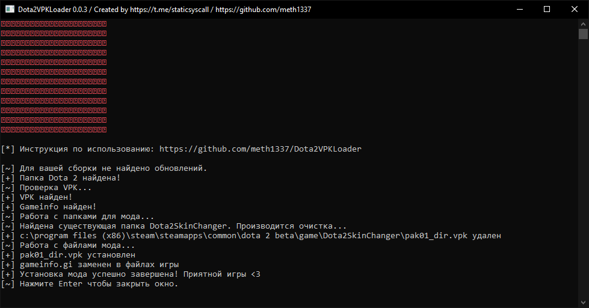

# Проект закрыт и больше обновляться или поддерживаться не будет.

<html>
    <h1>Dota2VPKLoader</h1>
    <div>
        
        
        
    </div>
 </html>   

Скрипт для автоматизации установки и использования модов для игры Dota 2. Скрипт автоматически определяет путь к папке с файлами игры Dota 2, проверяет наличие файлов мода (`pak01_dir.vpk` и `gameinfo.gi`), создает необходимые папки и копирует файлы мода в соответствующие директории. Для поиска папки с файлами игры используется реестр Windows.

## Требования
- Установленная игра Dota 2
- Мод для установки.

## Использование
1. Скачайте последнюю стабильную сборку скрипта [отсюда](https://github.com/qqqwwqeeqqwe/Dota2VPKLoader/releases/latest). (Файл: `Dota2VPKLoader-версия.zip`)
2. Распакуйте архив в отдельную папку
3. Поместите ваш мод в папку со скриптом. (Ваш мод должен называться `pak01_dir.vpk`)
4. Запустите `Dota2VPKLoader.exe` и следуйте инструкции в открывшемся окне.

## Пример использования


## Примечания
- При возникновении ошибок во время выполнения скрипта, программа автоматически отправит отчет об ошибке в виде текстового файла мне в Telegram-бота. Если вы хотите предоставить дополнительную информацию или задать вопросы, не стесняйтесь связаться со мной в Telegram ([@staticsyscall](https://t.me/staticsyscall)) для получения помощи.
- При запуске скрипт проверяет наличие обновлений для вашей сборки. Если таковые есть, скрипт предложить вам их установить.

## Пользовательские скрипты
Скрипт поддерживает выполнение пользовательских скриптов. Для этого необходимо создать папку "Scripts" в директории со скриптом и поместить в нее файлы скриптов с расширением `.py`. Скрипты будут автоматически загружены и выполнены при запуске основного скрипта, **после нахождения папки с файлами игры**. Каждый пользовательский скрипт должен содержать функцию `main()`, которая будет вызываться при выполнении скрипта.<br>
Пример пользовательского скрипта:
```Python
# Здесь могут находиться любые библиотеки / Переменные
import os  # Пример импорта библиотеки
text = "Hello!"  # Пример переменной

def print_text(text):  # Пример второстепенной функции  
    print(text)
    
def main():  # Главная функция которая должна находиться в любом пользовательском скрипте, основной скрипт будет выполнять все то что находиться в этой функции
    print_text(text=text)
```

**Получить больше информации о создании пользовательских скриптов для Dota2VPKLoader можно [тут](https://github.com/meth1337/Dota2VPKLoader/tree/main/src/Dota2VPKLoaderScriptSDK).**
## Лицензия
Dota2VPKLoader распространяется под лицензией MIT. См. файл [LICENSE](https://github.com/meth1337/Dota2VPKLoader/blob/main/LICENSE.md) для получения дополнительной информации.
