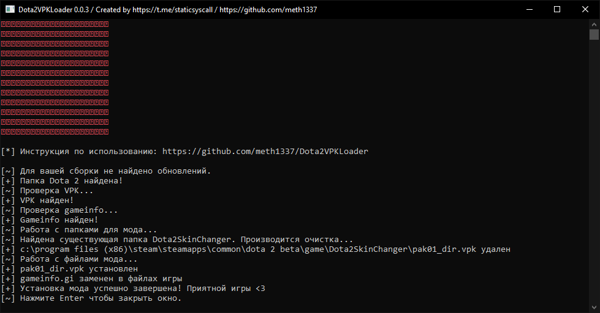

# Dota2VPKLoader
Скрипт для автоматизации установки и использования модов для игры Dota 2. Скрипт автоматически определяет путь к папке с файлами игры Dota 2, проверяет наличие файлов мода (`pak01_dir.vpk` и `gameinfo.gi`), создает необходимые папки и копирует файлы мода в соответствующие директории. Для поиска папки с файлами игры используется реестр Windows.

## Требования
- Установленная игра Dota 2
- Мод для установки.

## Использование
1. Скачайте последнюю стабильную сборку скрипта [отсюда](https://github.com/meth1337/Dota2VPKLoader/releases/latest). (Файл: `Dota2VPKLoader-версия.zip`)
2. Распакуйте архив в отдельную папку
3. Поместите ваш мод в папку со скриптом. (Ваш мод должен называться `pak01_dir.vpk`)
4. Запустите `Dota2VPKLoader.exe` и следуйте инструкции в открывшемся окне.

## Пример использования

## Примечания
- При возникновении ошибок во время выполнения скрипта, программа автоматически сохранит отчет об ошибке в виде текстового файла. Вы можете отправить этот файл мне в Telegram ([@staticsyscall](https://t.me/staticsyscall)) для получения помощи.
- При запуске скрипт проверяет наличие обновлений для вашей сборки. Если таковые есть, скрипт предложить вам их установить.

## Лицензия
Dota2VPKLoader распространяется под лицензией MIT. См. файл [LICENSE](https://github.com/meth1337/Dota2VPKLoader/blob/main/LICENSE.md) для получения дополнительной информации.
